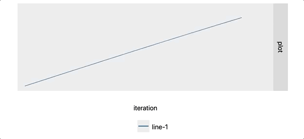
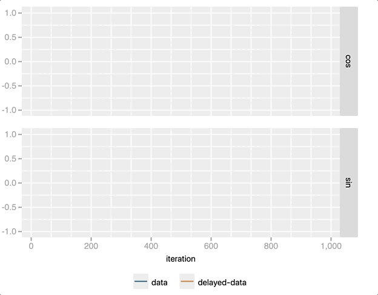
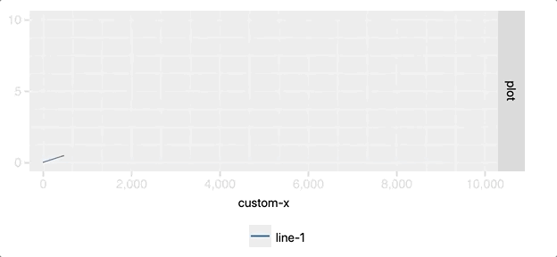
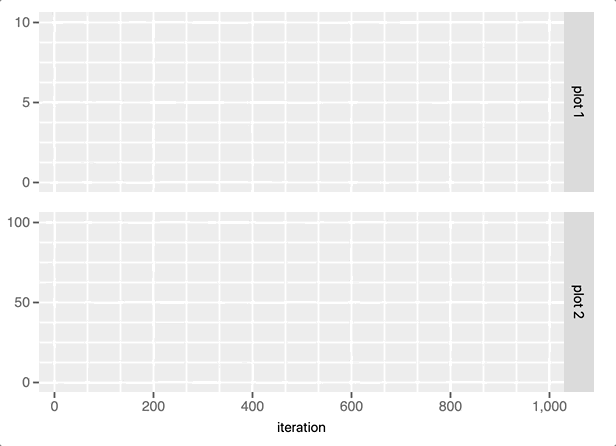

<!--

#################################################
### THIS FILE WAS AUTOGENERATED! DO NOT EDIT! ###
#################################################
# file to edit: notebooks/index.ipynb
# command to build the docs after a change: nbdev_build_docs

-->

# jupyterplot

> Create real-time plots in Jupyter notebooks.


## What is it?

It generalises Andreas Madsen's excellent [python-lrcurve](https://github.com/AndreasMadsen/python-lrcurve) library for machine learning to produce visualisations for arbitrary functions in real-time.


## Install

`pip install jupyterplot`

## How to use
### Single plot

Creating a simple real-time plot in a Jupyter notebook is as easy as easy as the following snippet:
<div class="codecell" markdown="1">
<div class="input_area" markdown="1">

```
from jupyterplot import ProgressPlot
import numpy as np

pp = ProgressPlot()
for i in range(1000):
    pp.update(np.sin(i / 100))
pp.finalize()
```

</div>

</div>



**Note:** The `pp.finalize()` statement is necessary to make the plots persistent between notebook sessions.

### Custom range
By default, the x and y ranges adapt to new data points. If the scale is known beforehand, it can be steadier to set it beforehand:
<div class="codecell" markdown="1">
<div class="input_area" markdown="1">

```
pp = ProgressPlot(x_lim=[0, 1000], y_lim=[-1.5, 1.5])
for i in range(1000):
    pp.update(np.sin(i / 100))
pp.finalize()
```

</div>

</div>


### Multiple lines
One can also plot several lines in parallel by specifying the line names in the constructor and passing all values in a list.
<div class="codecell" markdown="1">
<div class="input_area" markdown="1">

```
pp = ProgressPlot(line_names=["lin", "log", "cos", "sin"],
                  x_lim=[0, 1000],
                  y_lim=[-1, 4])

for i in range(1000):
    pp.update([[i / 250, np.log10(i + 1), np.cos(i / 100), np.sin(i / 100)]])
pp.finalize()
```

</div>

</div>


**Note:** The data is fed to `pp.update()` as a list of lists, where each sublist corresponds to the curves that are generated in each subplot.

### Multiple plots
<div class="codecell" markdown="1">
<div class="input_area" markdown="1">

```
pp = ProgressPlot(plot_names=["cos", "sin"],
                  line_names=["data", "delayed-data"],
                  x_lim=[0, 1000],
                  y_lim=[-1, 1])

for i in range(1000):
    pp.update([[np.cos(i / 100), np.cos((i + 20) / 100)],
               [np.sin(i / 100), np.sin((i + 20) / 100)]])
pp.finalize()
```

</div>

</div>



### Custom x-values
If the x values should not be incremented by 1 at every update one can set the `x_iterator=False`. This requires passing two values to the `update(x, y)`, where `x` is an `int` or `float` and `y` follows the same format as in the previous examples.
<div class="codecell" markdown="1">
<div class="input_area" markdown="1">

```
pp = ProgressPlot(x_iterator=False, x_label="custom-x", x_lim=[0, 10000], y_lim=[0, 10])
for i in range(1000):
    pp.update(10 * i, i / 100)
pp.finalize()
```

</div>

</div>



### Decoupled y-limits
If each subplot should have different y-limits then the y-limits can be passed as a list containing the the limits for each subplot.
<div class="codecell" markdown="1">
<div class="input_area" markdown="1">

```
pp = ProgressPlot(plot_names=['plot 1', 'plot 2'], x_lim=[0, 1000], y_lim=[[0, 10],[0, 100]])
for i in range(1000):
    pp.update([[(i/100)], [(i/100)**2]])
```

</div>

</div>



### Input format
#### Single plot, single line
If the progress plot consists of a single plot with a single line one can pass the y-updates as `int` or `float`.
#### Multiple plots, multiple lines
If multiple plots or lines are used, the y-updates can either be lists or dicts:
```python
y_update_list = [[y_plot_1_line_1, y_plot_1_line_2],
                 [y_plot_2_line_1, y_plot_2_line_2]]

y_update_dict = {'plot_name_1': {'line_name_1': y_plot_1_line_1,
                                 'line_name_2': y_plot_1_line_2},
                 'plot_name_2': {'line_name_1': y_plot_2_line_1,
                                 'line_name_2': y_plot_2_line_2}}
``` 

## Limitations

* Only one `ProgressPlot()` object can be used at a time. 
* Each subplot must have the same number of lines.
* The same color cycle for each subplot is used.
